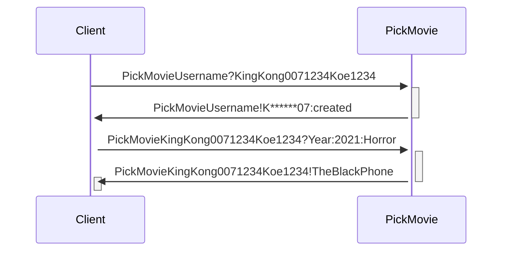
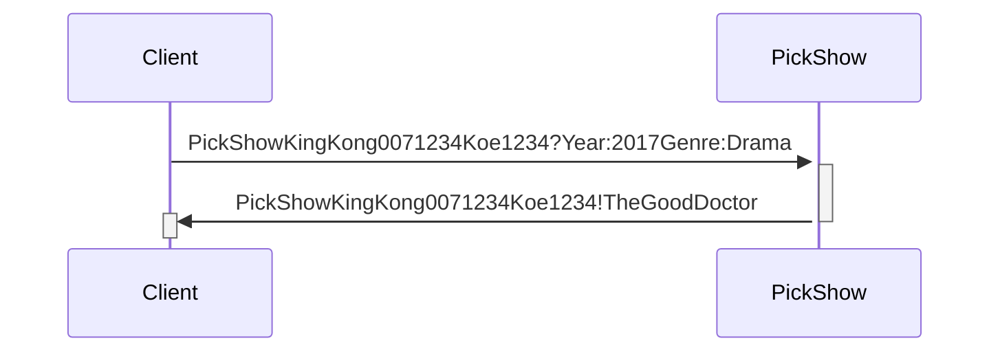
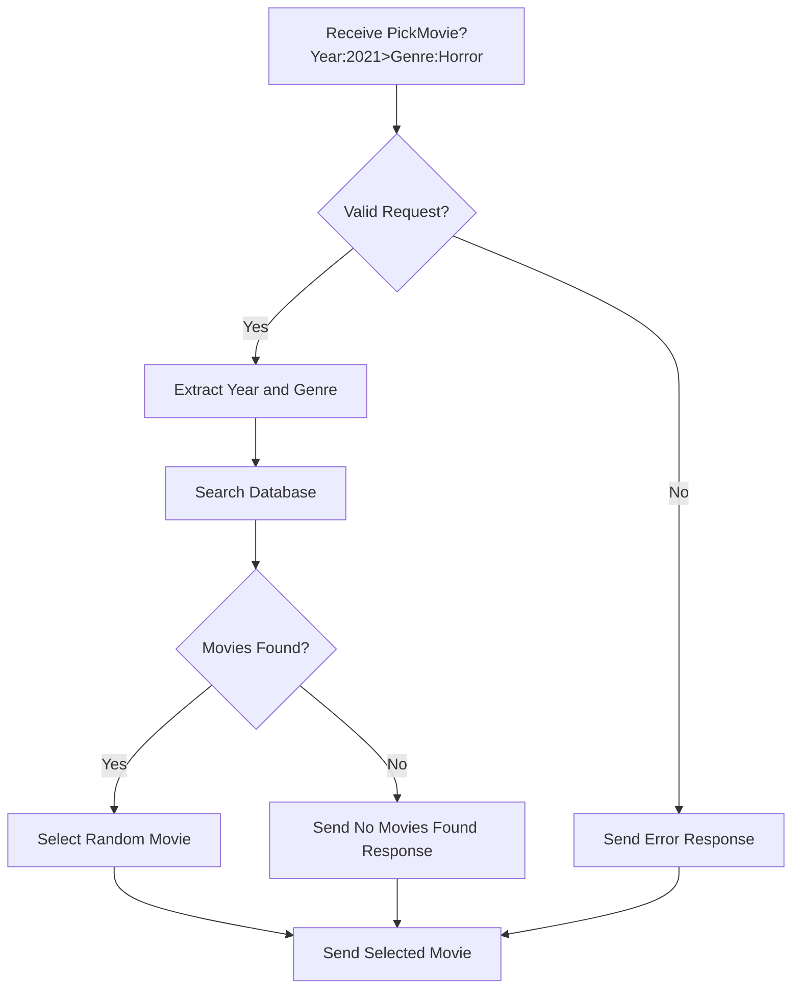

# Network_Zmq


## Info

Can't find a good movie to watch? 

Don't worry about it with these servers. You can easily ask what you want to watch, choose up to 18 genres, and even specify a year if you want. It will give you a random movie or show depending on whether you used PickMovie or PickShow.
# Client side
## Movies


## Shows



### Movies

1. **Client Sends Username and Password for Security**: To ensure security and prevent unauthorized access, the client sends both the username and password as the initial step. This is done by sending a request to the server pushing to `PickMovieUsername?`. The data being pushed includes the username `KingKong007` and the password `1234Koe1234`.

2. **Server Response**: Upon receiving the username and password request, the server processes it and replies back to the client. The server responds with `PickMovieUsername!K******07:created`, indicating that the username `KingKong007` has been successfully created.

3. **Client Picks Movie**: Following the creation of the username, the client sends another request to the server specifying the movie preferences. The request is in the form `PickMovieKingKong0071234Koe1234?Year:2021:Horror`.

4. **Server Response with Movie Selection**: The server processes the movie request and replies back to the client with the selected movie. The response is `PickMovieKingKong0071234Koe1234!TheBlackPhone`, indicating that the movie "The Black Phone" has been selected.

### Shows

1. **Client Picks Show**: Following the creation of the username, the client sends another request to the server specifying the show preferences. The request is in the form `PickShowKingKong0071234Koe1234?Year:2017Genre:Drama`.

2. **Server Response with Show Selection**: The server processes the show request and replies back to the client with the selected show. The response is `PickShowKingKong0071234Koe1234!TheGoodDoctor`, indicating that the show "The Good Doctor" has been selected.


# Server side

**1. Receive PickMovie Request:** The system receives a request to pick a movie, which includes information about the desired year (2021) and genre (Horror).

**2. Check Validity of Request:** The system checks if the received request is valid. If it is valid, the flow continues; otherwise, an error response is sent.

**3. Extract Year and Genre:** If the request is valid, the system extracts the year (2021) and genre (Horror) from the request.

**4. Search Database:** The system searches the database for movies that match the specified year and genre.

**5. Check for Movies Found:** If movies matching the specified criteria are found in the database, the flow proceeds to select a random movie from the list of found movies. If no movies are found, a response indicating no matches is sent.

**6. Select Random Movie:** If movies are found, the system randomly selects one movie from the list of found movies.

**7. Send Response:** Finally, the system sends a response to the client, which includes the selected movie. If there was an error or no movies were found, the appropriate response is sent.


# Movie Genre

| # | Genre            | # | Genre            | # | Genre            |
|---|------------------|---|------------------|---|------------------|
| 1 | Action           | 7 | Fantasy          | 13 | Science Fiction |
| 2 | Adventure        | 8 | Historical       | 14 | Thriller        |
| 3 | Animation        | 9 | Horror           | 15 | War             |
| 4 | Comedy           |10 | Musical          | 16 | Documentary     |
| 5 | Crime            |11 | Mystery          | 17 | Family          |
| 6 | Drama            |12 | Romance          | 18 | Sports          |


## Setting up ZeroMQ (ZMQ) in a QT Project with MinGW

### Steps

1. **Copy Folders**:
   - Make a copy of the 'include' folder and the 'lib' folder provided in the github.
   - [include](https://github.com/CeyhanYildiz/Network_Zmq/tree/main/include)
   - [lib](https://github.com/CeyhanYildiz/Network_Zmq/tree/main/lib)

2. **Create a QT Project**:
   - Open QT Creator and create a new project.
   - Choose MinGW as the compiler toolchain.

3. **Modify the .pro File**:
   - Open the project's .pro file.
   - Add the following lines to the .pro file:
     ```pro
     TEMPLATE = app
     CONFIG += console c++11
     CONFIG -= app_bundle

     DEFINES += ZMQ_STATIC
     LIBS += -L$$PWD/../lib -lnzmqt -lzmq -lws2_32 -lIphlpapi
     INCLUDEPATH += $$PWD/../include

     SOURCES += main.cpp
     ```

4. **Test the Setup**:
   - Use ZMQbroker or write a simple test application to ensure the setup is correct.
   - Compile and run the project to verify that it works as expected.

### Notes
- `DEFINES += ZMQ_STATIC`: Defines the `ZMQ_STATIC` macro for static linking.
- `LIBS += -L$$PWD/../lib -lnzmqt -lzmq -lws2_32 -lIphlpapi`: Links against the necessary ZeroMQ libraries and Windows socket libraries.
- `INCLUDEPATH += $$PWD/../include`: Adds the path to the ZeroMQ headers.
