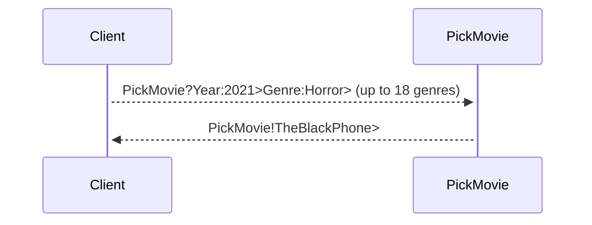
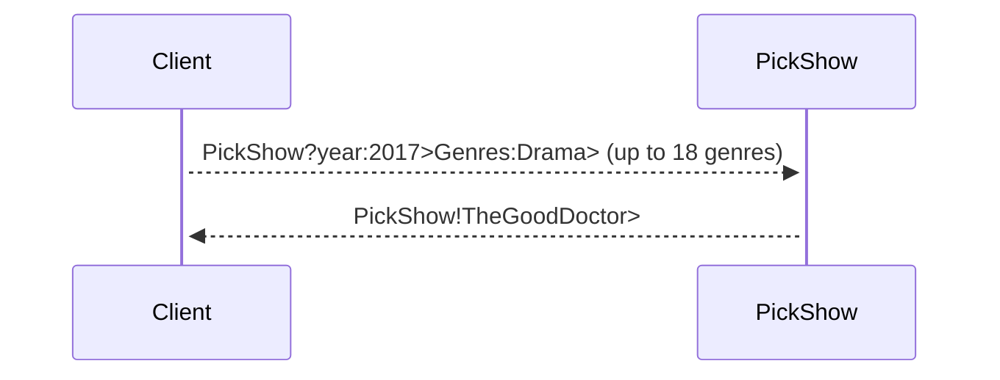
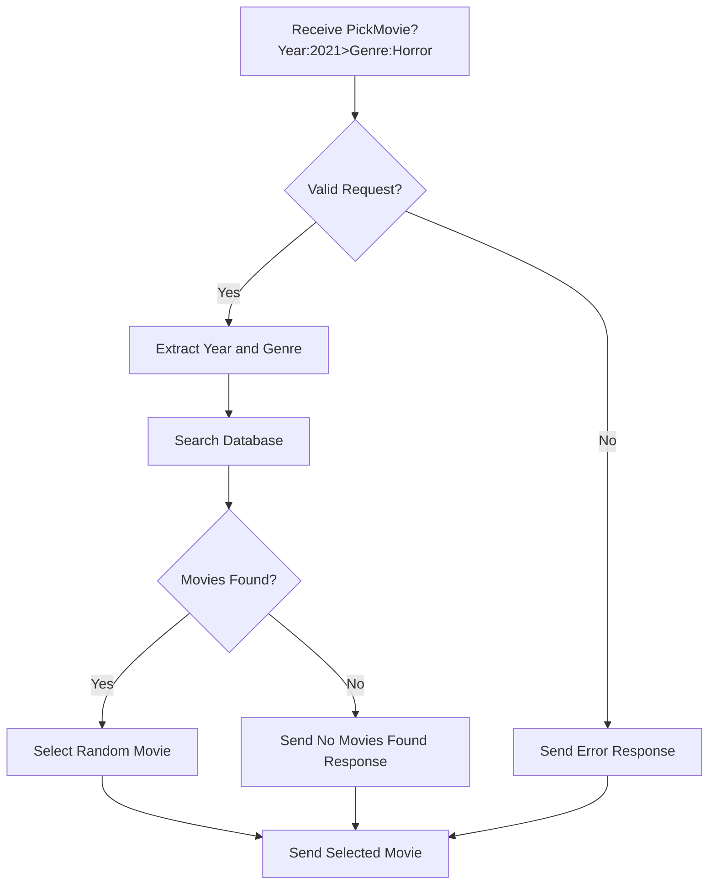

# Network_Zmq


## Info

Can't find a good movie to watch? 

Don't worry about it with these servers. You can easily ask what you want to watch, choose up to 18 genres, and even specify a year if you want. It will give you a random movie or show depending on whether you used PickMovie or PickShow.
# Client side
## Movies


## Shows


# Server side

# Movie Genre

1. Action 
2. Adventure 
3. Animation
4. Comedy 
5. Crime 
6. Drama
7. Fantasy 
8. Historical 
9. Horror
10. Musical 
11. Mystery 
12. Romance
13. Science Fiction 
14. Thriller 
15. War
16. Documentary 
17. Family
18. Sports


## Setting up ZeroMQ (ZMQ) in a QT Project with MinGW

### Steps

1. **Copy Folders**:
   - Make a copy of the 'include' folder and the 'lib' folder provided in the github.
   - [include](https://github.com/CeyhanYildiz/Network_Zmq/tree/main/include)
   - [lib](https://github.com/CeyhanYildiz/Network_Zmq/tree/main/lib)

2. **Create a QT Project**:
   - Open QT Creator and create a new project.
   - Choose MinGW as the compiler toolchain.

3. **Modify the .pro File**:
   - Open the project's .pro file.
   - Add the following lines to the .pro file:
     ```pro
     TEMPLATE = app
     CONFIG += console c++11
     CONFIG -= app_bundle

     DEFINES += ZMQ_STATIC
     LIBS += -L$$PWD/../lib -lnzmqt -lzmq -lws2_32 -lIphlpapi
     INCLUDEPATH += $$PWD/../include

     SOURCES += main.cpp
     ```

4. **Test the Setup**:
   - Use ZMQbroker or write a simple test application to ensure the setup is correct.
   - Compile and run the project to verify that it works as expected.

### Notes
- `DEFINES += ZMQ_STATIC`: Defines the `ZMQ_STATIC` macro for static linking.
- `LIBS += -L$$PWD/../lib -lnzmqt -lzmq -lws2_32 -lIphlpapi`: Links against the necessary ZeroMQ libraries and Windows socket libraries.
- `INCLUDEPATH += $$PWD/../include`: Adds the path to the ZeroMQ headers.
